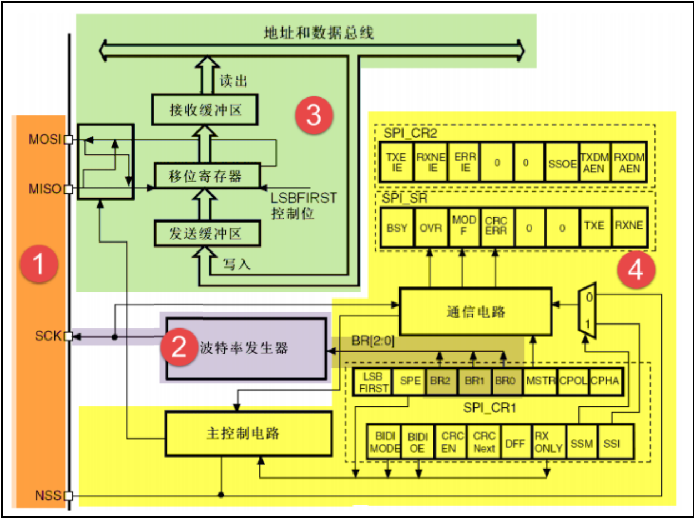
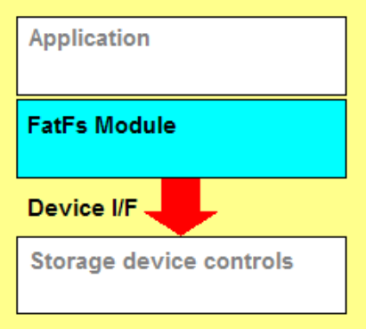
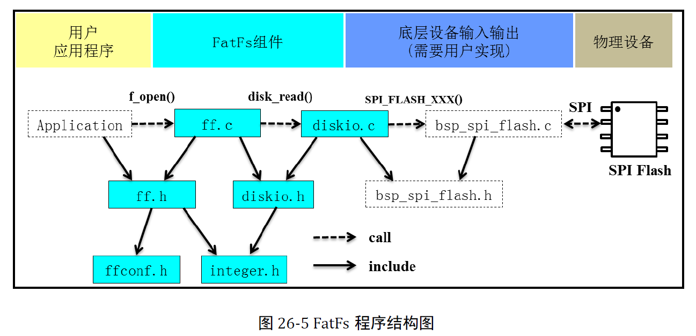
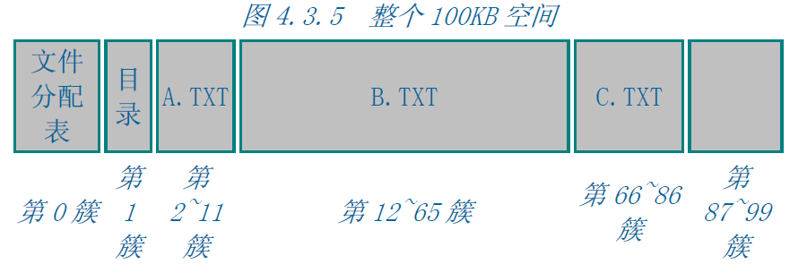

# 嵌入式随笔

> PS:该笔记暂时是一些零碎的知识点，来源于我平时的学习中遇到的问题和思考

## 关于STM32运行程序时代码和数据的存放位置

嵌入式的微处理器/微控制器一般都是用的是哈佛结构的，其指令和数据是分开存放的。

以STM32F103为例，一个程序编译加载后，**代码部分（Code）存放在片内FLASH中，变量/数据部分（Data）存放在片内SRAM中**，但是有一个例外，那就是：**常量（用const修饰的）的数据会被放在FLASH中，因为不会改变**，普通的变量/数据还是存放在SRAM中的。

> 参考资料：
>
> https://blog.csdn.net/YinShiJiaW/article/details/101433067
>
> https://zhidao.baidu.com/question/497579710320154844.html

## 关于SPI的数据发送和接收

由于SPI有MOSI、MISO两条数据线，所以支持全双工通信。SPI有一个特点就是，主机（Master）从MOSI发送一个字节的时候，同时也会从MISO接收到一个字节的数据，无论发送的字节有没有意义，都会接收到一个字节，可以称为**数据交换**。

接收到的数据与对方的**移位寄存器**中的内容有关，所以有时候并不能确定，这与对方之前发送/接收过什么数据有关，大部分都是无意义的值（当你发送的也是无意义的数据时）。

有一点要注意的是，即使只是需要主机发送数据给从机的话，也要记得读出接收数据寄存器的值（使用ReceiveData库函数）。如果不读出来的话，发送下一个字节后又会接收到一个新的字节，然后会导致**产生溢出标志OVR**，然后硬件会锁住接收数据寄存器中之前的值，而不会更新为最新的值，从而导致你真正需要读取数据时读取的数据与理论的不符。

> 参考资料：
>
> https://www.cnblogs.com/aaronLinux/p/6219146.html
>
> https://blog.csdn.net/guozhongwei1/article/details/44921709
>
> https://blog.csdn.net/ycli12/article/details/48448443

## 关于文件系统的移植

文件系统就是用来管理文件的（软件）系统，类似于图书管理员，**它位于驱动层之上，应用层之下**。

对一个硬盘进行相应文件系统的格式化就是擦除该硬盘上的所有东西，然后建立一个该文件系统的管理结构，对于FatFs来说，就是文件分配表、目录。

上面说过，文件系统位于应用层和驱动层之间，向上为应用提供文件操作的接口，向下需要驱动层提供基本的读写等操作的驱动。这需要我们在文件系统的源码中的底层部分（对于FatFs来说是diskio.c这个文件）添加/修改相应的函数来调用写好的驱动函数，因此只要针对不同的设备编写不同的驱动就可以使用不同的设备了，这就叫“移植”。

文件系统**挂载**的意思就是把格式化后的设备/分区的访问入口挂载到一个由系统软件设置的目录的路径下，便于人们访问。查看FatFs的源码就可以知道，它的挂载就是把物理的设备/卷的路径（逻辑设备号）分配一个FatFs文件系统的结构体（FATFS），该结构体记录着该设备/卷的各种信息（Linux支持自定义设置挂载的路径，**我猜**挂在路径的设置就是在相应的文件系统的结构体中设置。但是FatFs貌似不支持自定义挂载的路径，因为我在FATFS中没有看到相应的成员）。

> 参考资料：
>
> http://elm-chan.org/fsw/ff/00index_e.html
>
> [https://baike.baidu.com/item/%E6%8C%82%E8%BD%BD/2366421](https://baike.baidu.com/item/挂载/2366421)
>
> 《STM32库开发实战指南》