# 计算机硬件系统设计

## 第一章

### 1.2险象

简单来说就是**组合逻辑**中，信号到达同一个地方（元件）的路径不一样，于是经历的时间（延迟）也不一样，这种现象也叫信号的竞争，这可能会导致毛刺（突变信号）的产生而导致输出错误，这就叫险象。

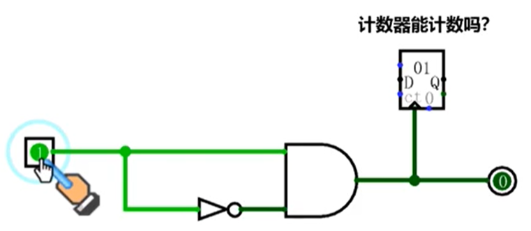

再Logisim中以一个与门为例，输入由高电平变为低电平时，会导致计数器计数+1，这是由于下方的信号信号传递到与门的时间比上方的长，当上方导线变为1时，下方仍然会保持一段时间的1（因为经过了一个非门）。

**如何消除竞争？**

使得信号的两条路径一致/相近。

在Logisim中，可以给上方的信号路径中增加一个缓冲器，或者把下方的非门集成到与门中。实际中这两种方法不一定有效。

## 第二章 

### 2.1 组合逻辑电路

组合逻辑电路的特点：

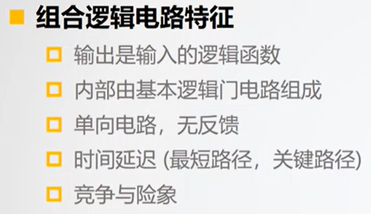

时间延迟最小的输出信号的路径称为**最短路径**，延迟最长的则称为**关键路径**。

竞争是针对输入信号而言的，险象是针对输出信号而言的。

组合逻辑电路的设计：

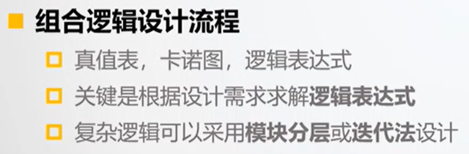

### 2.2 同步时序逻辑电路

#### 组合逻辑和时序逻辑的区别

**组合逻辑电路：**任意时刻的输出仅仅取决于该时刻的输入，与电路原来的状态无关。

**时序逻辑电路：**任意时刻的输出不仅取决于当时的输入，还取决于电路原来的状态。（具有**记忆功能**）

同步时序中的同步指的就是各个部分的时钟具有确定的因果关系，异步指的就是各个部分的时钟之间没有因果关系。

状态机就是一个同步时序逻辑电路。

状态机原理图：

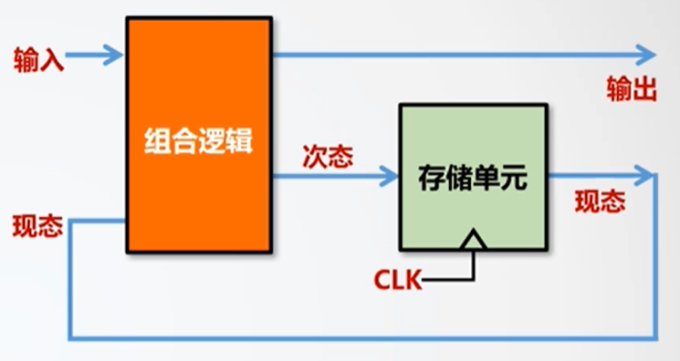

这个图表示的是米里型状态机 ，因为输出与输入有关。若输出与输入无关，则为摩尔型状态机。

更细分后的图如下：

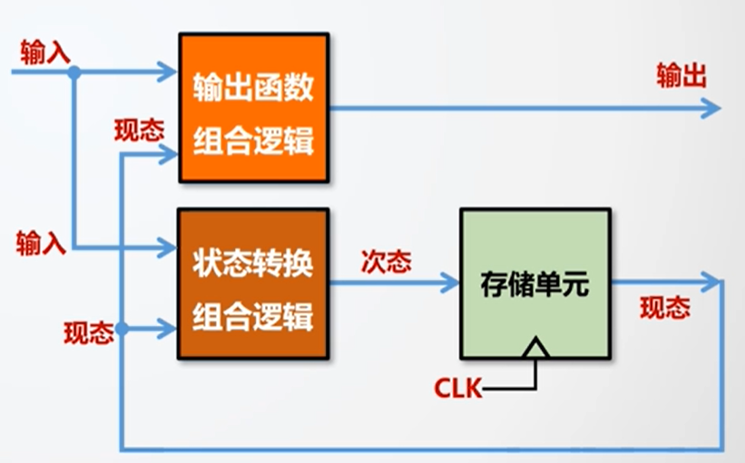

特点：

设计流程：

## 第三章

### 汉字编码

汉字编码有三种：

- **机内码：**机内码就是我们通常说的计算机内部存储字符所用的编码，常见的有：ASCII、UTF-8、GBK、GB2312等。
- **区位码：**区位码是为了方便我们查找、使用汉字的一种编码，国标汉字的区位码是由一个94*94的矩阵实现的，行对应区号，列对应位号。行列都是从1开始编号。
- **字形码：**字形码是为了在显示屏/LED点阵等显示设备上显示对应的汉字所使用的编码，汉字字库文件就是用的字形码。

汉字的机内码和区位码的转换公式：

`GB2312汉字机内码 = 区位码 + 0xA0A0`

> **Q：**如何用加法器实现减法？
>
> **A：**这个实现可以有两个解释，第一种是：将两个原码的运算转换为两个补码的运算。第二种见博客：https://www.cnblogs.com/mcdeggy/p/7509887.html。本质上是一样的。
>
> 下面我来说明一下第一种是如何解释的：
>
> 以GB2312机内码转换为区位码为例，可设机内码为X，区位码为Y，则X-0xA0A0 = Y。
>
> 由于X的两个肯定都大于A0（GB2312的编码规范），所以我们可以用两个8位的加法器来实现。于是只考虑一个8位的减法情况。
>
> 假设两个相减的8位数分别为0xA3，0xA0。为了转化为补码，在这两个8位数的前面再增加一位符号位，于是就变为了0x0A3，0x0A0，这里我们只看低9位。按照减法变加法的规则，减去一个数等于加上这个数的**相反数的补码**，于是减数就变成了0x160，与0x0A3相加后，得到0x203，但是由于我们只看低9位，同时只能使用低8位（第9位是我们想象中加上去的），所以结果就是0x03，与预期的减法结果一致。
>
> 这两种说法都利用的是**位数固定**的数的溢出，这有一个blog感觉讲的不错：https://blog.csdn.net/qq_35513792/article/details/85044216
>
> 
>
> PS：上面那个例子能得到正确的结果是在结果没有超出8位无符号数（因为这里的编码用的都是无符号数）所表示的范围的（0-255）。如果结果是负数，那么就会产生负溢出。下面以0xA0为被减数，0xA3为减数，重做一遍：
>
> 0xA0 - 0xA3 = 0x0A0 + 0x15D = 0x1FD，只看低8位为0xFD，按照无符号数来解释，结果就是163，与预期结果-3相差很大，主要原因就是结果超出了无符号数的表示范围。
>
> 如果将减数和被减数都看为有符号数原码，那么就不需要我们额外再加一位符号位了，结果也应被解释为有符号数，那么过程就是这样的：0xA0(-32)-0xA3(-35) = 0xE0(被减数的补码) + 0x23(35的补码) = 0x103 = 0x03(3)，结果正确。
>
> 这里有一个点需要注意的就是，有符号数和无符号数的计算中虽然都存在“溢出”现象，但他们有时候并不是真的溢出，只有在超出了表示范围时才是真的溢出。

### 海明编码

首先要了解什么时海明码，这有两个博客我觉得不错：

- https://blog.csdn.net/flyyufenfei/article/details/72235748

- https://blog.csdn.net/weixin_37641832/article/details/89060941

其中第二个博客在计算P4时的公式有些问题，应该只有D5，同时第二个表中的$P_4$错写成了$P_8$不过问题不大，结果是一样的。

由海明编码的原理可知，海明码其实是按照数据位置的二进制值中各位是0还是1来分组进行奇/偶校验的。一位二进制会参与到多个校验组中，从而可以定位。

原版的海明码只能检出1位错，我们可以多加一位整体的奇偶校验位，从而可以检测出是否有2位出错（这个是在确定没有3位及以上错误前提下），但是只能纠错1位，于是经过解码器后还是有1位错码，且不能确定位置，所以不可靠，只能要求重传。

（其实好像可以检测更多的错误——只要最终的检测位（G1-G5）不为0就知道有错误发生了。

> 一个小知识：一个bit与0异或，结果与原比特保持一致（不变）；与1异或，则结果与原比特相反（取反）

### CRC编码

首先了解一下什么是CRC编码：https://blog.csdn.net/include_zrl/article/details/89762589

需要注意的时CRC采用的是**模2除法**，而不是普通的除法。模2除法并不需要借位。

CRC的硬件实现如下，分为串行和并行两种：

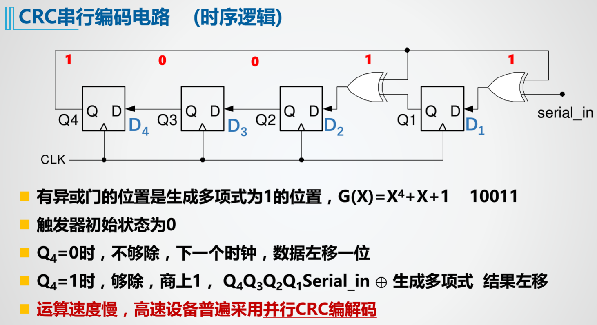

CRC也可以检多纠1，其纠错原理见如下文章中的分析 ：

https://zhuanlan.zhihu.com/p/133491802

**利用的是不同位置的bit的模2除法的余数都是固定的**，将得到的余数W和每一个bit相对应的余数进行异或，若最后得到的值全为0（全为0说明两个异或的值相等），即表示这一位出错。

## 第四章 ALU设计

### 快速加法器

#### 1位全加器

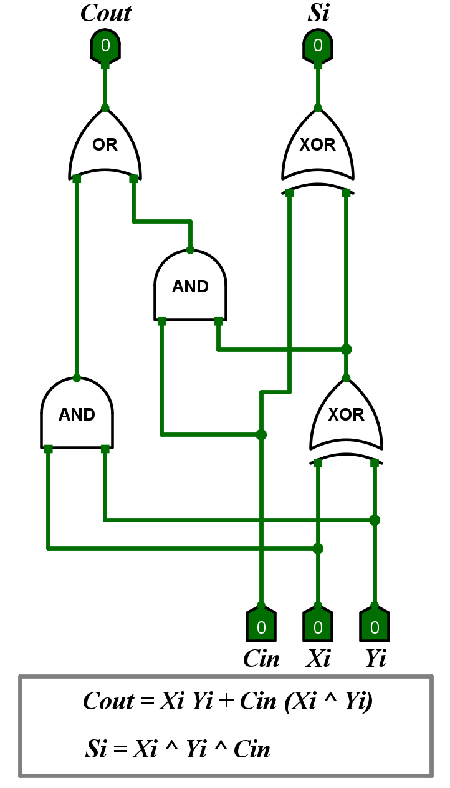

如果按照传统的方法（串联）构造多位的全加器的话，那么输出信号Cout就要接入到下一级的Cin去，这个1位全加器的关键路径是经过了3个门。下一级的Cout又要接到下下一级的Cin，那么最后一级（最高位）的全加器要得到正确的输出就需要经过较长的延迟，这很浪费时间。下图就是一个串联的8位加法器，其中FA（Full Adder）是全加器的简称，OF（OverFlow）是有符号运算时的溢出标志。

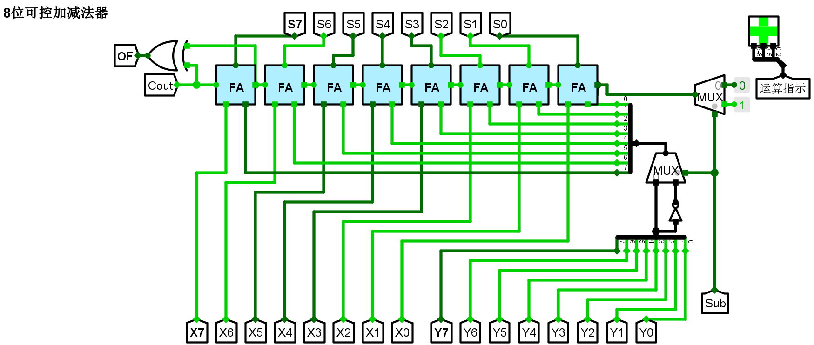

> PS：一个小知识点
>
> **如何判断有符号的运算是否溢出？**
>
> 推荐两个blog：
>
> - https://blog.csdn.net/L20902/article/details/86551259
> - https://blog.csdn.net/alinyua/article/details/79732701
>
> 一般我们实现就是用最高位和次高位的进位标志异或来判断（如图）。

#### 先行进位加法器

既然知道了串联的加法器的延迟很大，那有没有什么办法呢？

很显然，办法就是并行操作——我们需要并行地得到每一位的进位，这样每一位的Cin经过的延迟都是一样的，延迟大大减小，没有先后，于是也不用担心竞争和冒险。

为了实现进位信号的并行，我们需要一个**先行进位模块**。

这里有一个 blog讲述了先行进位的原理：

- https://www.cnblogs.com/haigege/archive/2011/09/30/2196275.html

简单来说，就是利用Cout的公式（$C_{i+1} = G_i + P_i\cdot C_i = X_i\cdot Y_i+(X_i+Y_i)\cdot C_i$）来进行迭代，得到$C_i$仅关于$G_i$和$P_i$的表达式，于是就消除了串联的关系，变为了并行。$G_i$和$P_i$被称为**进位的传递函数**。

https://www.cnblogs.com/migeater/p/9102195.html 中的4位先行进位CLA74182示意图如下：

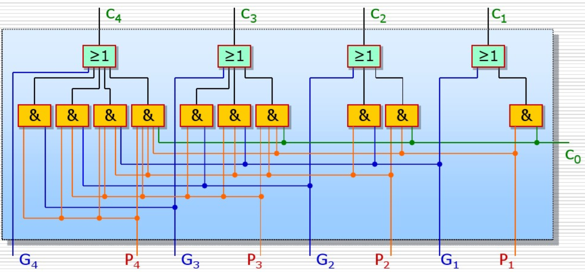

由图可以看出，不同进位C1~4的延迟都变为为2个门电路的延迟了（加上G和P的延迟就是3个门电路的延迟），这比串联的4位加法器的延迟（3×4=12）要少许多。

于是我们可以根据CLA74182搭建一个4位快速加法器，如下图（下图的X0、Y0就是X1、Y1，后面依次递增）：

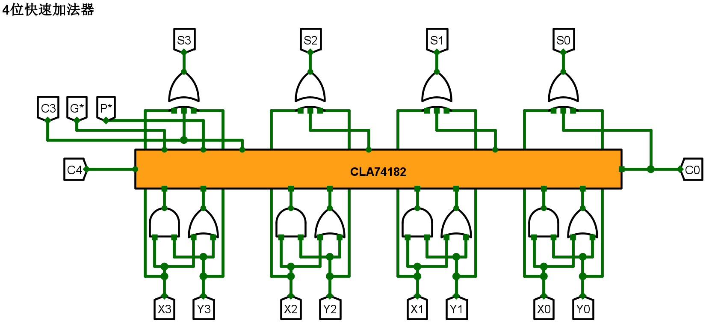

其中的G\*和P\*信号之前并没有说到，这两个信号是用来为后面构成更多位数的快速加法器而保留的。G\*和P\*被称为**成组**进位的传递函数，这个成组的理解就是多位加法器（一组）的进位传递函数，在这个4位快速加法器中，就是最高位的仅为传递函数（也就是下图的C4位），它们被传递给下一级的CLA74182，来组成更多位数的快速加法器。

> 一个4位快速加法器的延迟是4个门电路延迟。

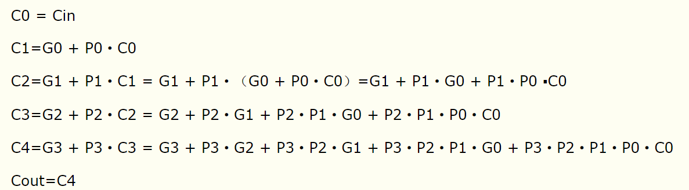

要使下一级也按照相同的C0和公式执行，即C1的那个公式，我们需要用C4的结果与之对比，就可以发现：

G0对应G3 + P3·G2 + P3·P2·G1 + P3·P2·P1·G0，P0对应P3·P2·P1·P0。

于是，我们令G\*=G3 + P3·G2 + P3·P2·G1 + P3·P2·P1·G0，P\*=P3·P2·P1·P0。这一部分组合逻应该是在CLA74182中实现的，不过上文的图中并没有画上去。

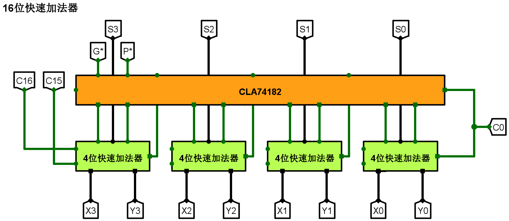

> 一个16位快速加法器的延迟是6个门电路。

于是我们可以利用4个4位快速加法器构成一个16位的快速加法器（如上图）。其实在这4个4位快速加法器之中，我们也可以通过4位快速加法器本身的C4输出连接到下一个4位加法器，因为4位快速加法器中C4的逻辑与CLA74182的一致。

就像这样：

也能正确运行。BUT！这样做的结果是又构成了一个串联的结构，所以**这种方案并并不可取**，所以我们才需要上层的CLA74182来实现并行逻辑。

32位的快速加法器如下：

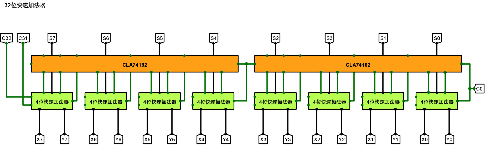

其实严格来说，这个32位的快速加法器并不是完全并行的，因为高16位和低16位的CLA74182是串联的，因此高16位的延迟比低16位的大。

> 这里有一个32位先行进位加法器的verilog实现（不过感觉综合后并不一定是并行的）：
>
> - https://blog.csdn.net/c602273091/article/details/39801529

### 乘法器

#### 阵列乘法器

缩位阵列，就是一组全加器组成的加法器阵列，即利用加法器阵列来实现乘法，具体的实现算法就是我们手动算乘法的方法，如下图：

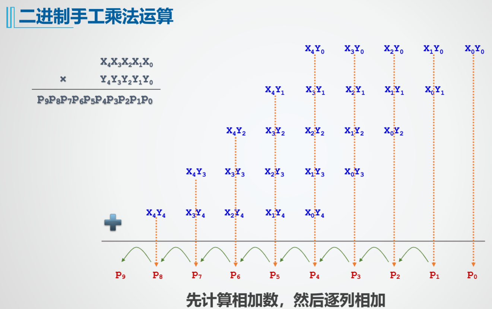

来源华中科技大学课件

其中的相加数——即$X_i Y_i$，可由与门实现。

具体又分为横向进位和斜向进位两类：

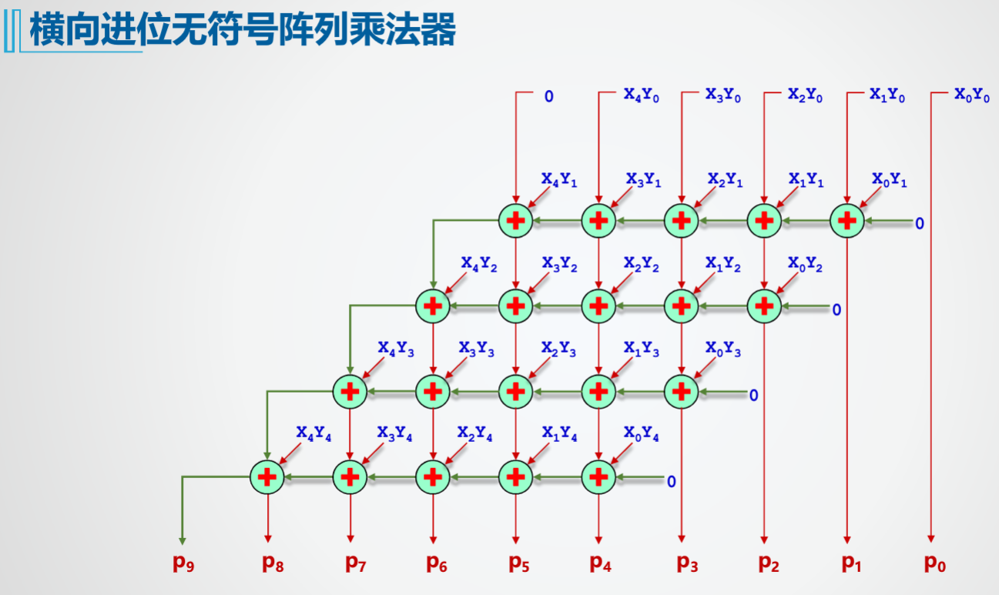

来源华中科技大学课件

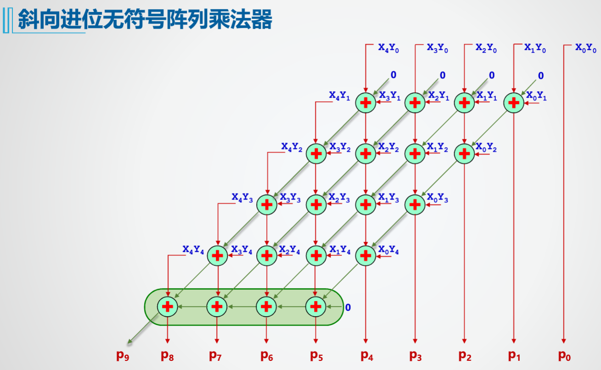

来源华中科技大学课件

横向进位的关键路径长度为11个加法器，而斜向进位仅为8个加法器。由此可见，**不同的硬件结构对性能的影响很大**，这是在硬件设计时候可以考虑优化的一点。

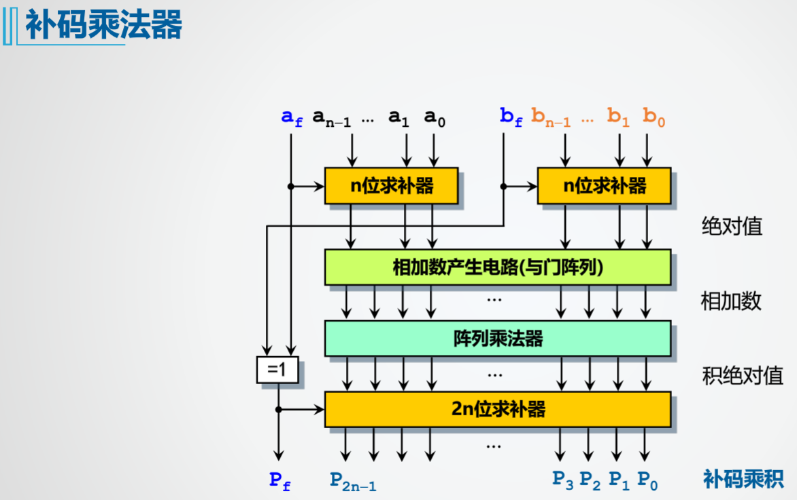

来源华中科技大学课件

上图是阵列乘法器来实现有符号的补码乘法的原理框架图，后面我们会采用更高级的方法（Booth算法）来实现。

#### 原码一位乘法器和补码一位乘法器

原理推导见一篇博客：

https://www.cnblogs.com/yjbjingcha/p/6956431.html

## 第五章 存储系统设计

> 首先补充一点硬件知识，关于DRAM和SRAM的区别：
>
> DRAM是动态随机存储器，SRAM是静态随机存储器。
>
> 这两个名字来源于它们本身的特点：DRAM由于结构的原因（利用电容），会缓慢地掉电，所以需要每隔一段时间刷新一次（充电），所以是动态的。而SRAM的结构（纯晶体管）则不会缓慢掉电，可以长时间保持（除了断电），不需要刷新，所以称为静态。
>
> 由于没有使用电容，SRAM的结构比DRAM要复杂很多，集成度较低，所以成本也高了很多，但是它的存取速度比DRAM要快许多。所以一般我们在要求高速度但容量要求不大的地方才会使用SRAM，比如CPU中的Cache，而在容量需求较大，但是对速度要求不是很高的地方会使用DRAM，比如内存。
>
> DRAM又根据是否需要时钟来通讯分为同步RAM（SDRAM）和异步RAM，SDRAM比异步RAM的速度更快，所以现在一般用的都是SDRAM。同时平常见到的DDR，代表的是Double Data Rate的意思，这是由于普通SDRAM只能在一个跳变沿（上升沿/下降沿）表示数据，而DDR技术则能够是之在两个跳变沿都表示数据，于是在一个时钟周期内就能表示两个数据了，速度直接翻倍。至于DDR2、DDR3、DDR4，后面的数字代表的是频率的不同，原理并没有本质区别。

### Cache映射机制与逻辑实现

#### 直接相联映射

直接相联就是主存中的一块（行）只能映射到Cache中固定的某一块（行）。

> 一块（Block）中包含多个字。

同时，主存会根据Cache的块的数量来分区，假设Cache有n块，那么主存中每n块就构成一个区。于是主存地址可以分为3个部分：**区地址、行地址、字地址**，如下图：

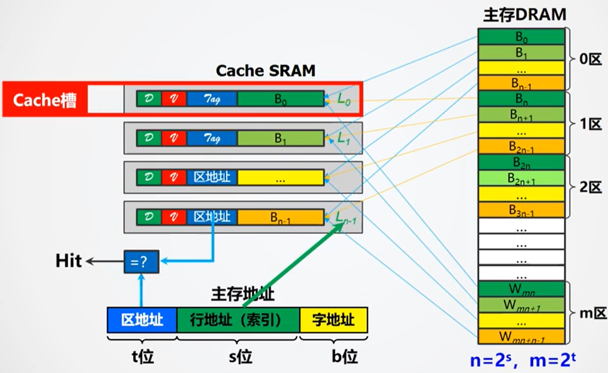

来源华中科技大学课件

Cache的存储器中，存储一行数据的同时，还会存储区地址以及一些标志位（有效位、一致性Dirty位），以供在查找数据的时候的判断。

查找的流程如下：

1. 根据行地址查找Cache中对应的行
2. 根据区地址（标记位TAG）以及一些标志位（有效位 ）来判断是否与主存中所要查找的区对应
3. 如果TAG一致，则输出该行的数据内容，同时根据字地址来选择最终字的输出
4. 如果TAG不一致，则从主存中载入到相应地址的内容到Cache中，再由Cache传输给CPU

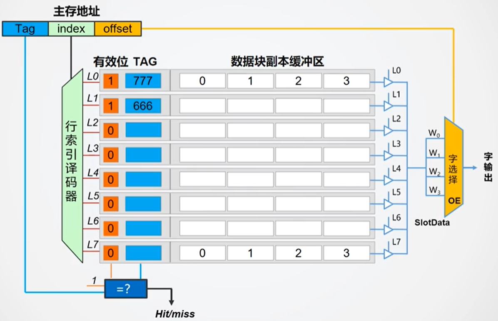

来源华中科技大学课件

> 这种方法的命中率较低，因为主存中的块只能对应一个Cache块。一个块可能刚进入Cache，就被另一个块给覆盖了。
>
> 不过其优点是硬件逻辑简单，成本较低。

#### 全相联映射

全相联就是主存中的任意一块（行）可以放在Cache中的任意一块（行）中，没有分区的概念。于是贮存地址就只分为两部分：**主存块地址（标记部分）、字地址**。

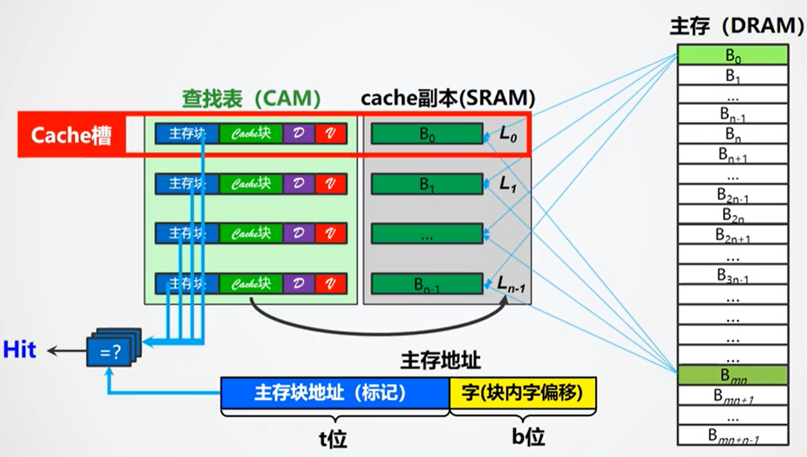

来源华中科技大学课件

由于主存中一个块对应的Cache块地址不确定，所以需要其他的结构来辅助确定，即查找表。查找表的行数与Cache的行数相同，每一行存放着一个主存块地址，一个对应的Cache块地址，以及一些标志位。值得注意的是，查找表（CAM）与Cache是分开存放的，而直接相联中的区地址、标记位等与Cache数据则是一起存放的。

查找流程如下：

1. 根据主存块地址在CAM中并行查找Cache中是否存在该块地址
2. 若存在，则根据该行对应的Cache块地址直接访问Cache中的相应行，然后根据字地址选择输出的字
3. 若不存在，则从RAM中载入相应地址的块到一个空的Cache行中，然后输出

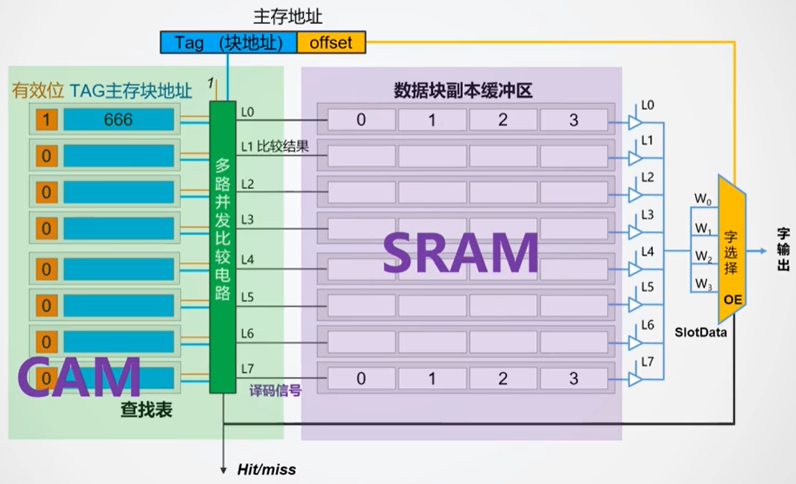

> 这种方法的命中率比直接相联要高不少，不过其缺点就是硬件开销较大。

#### 组相联映射

组相联映射结合了直接相联和全相联的特点，首先将Cache分为n组，一组中有k行。主存中也是按照每n行进行分割（类比直接相联的分区），每一行只能进入到相应的Cache组中，但是可以是组中的任意一行（类比全相联）。

> 每一组中的行数即路数，有k行则被称为k路组相联

于是主存的地址就被分为3个部分：**标记字段（区地址）、组地址、字地址。**

Cache中一行的组成与直接相联映射类似。

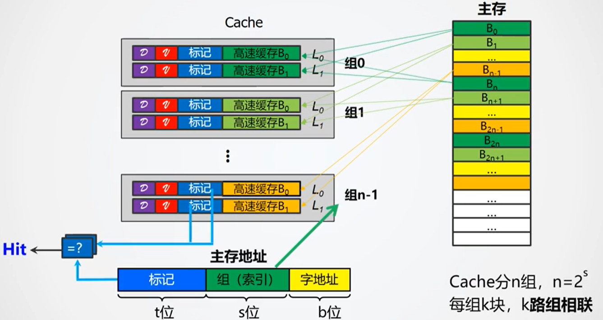

查找的流程如下：

1. 首先根据组地址来确定所要查找的组，相应的组信号（S0-3）
2. 根据标记字段TAG、有效位确定所要查找的行是否存在于该组中，并输出相应信号（K0、K1…）
3. 根据（K0、K1…）以及组信号（S0-3）确定Cache中具体的某一行
4. 根据字地址选择最终输出的字
5. 若在第2步中，不存在所要查找的行，则从主存中载入，然后再进行步骤3

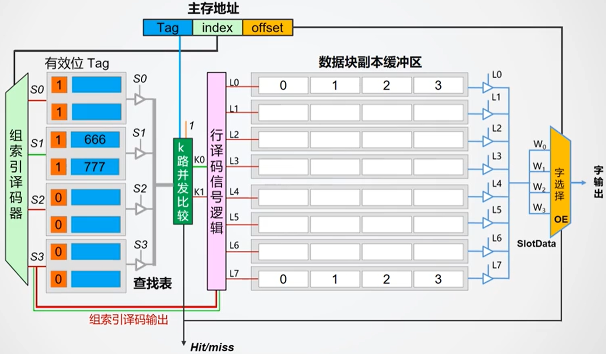

> 由组相联的映射机制可知，它结合了直接相联和全相联的特点，是一个比较折中的方案，命中率相比直接相联要高，但是硬件成本也要高一些，相比全相联，其硬件成本较低，但是命中率也要低一些。

> 所以，我们可以得到一个真理——这个世界上没有什么事物是各个方面都理想的，想要有所收获，就要付出相应的代价！
>
> 同理，想成为大佬就要付出努力！

